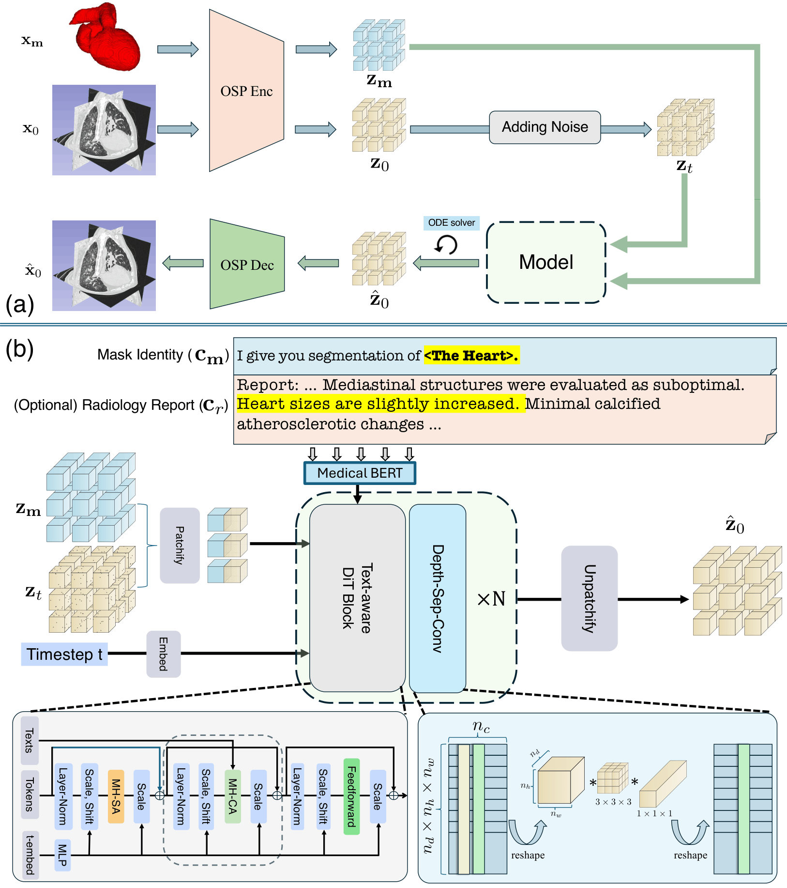

# <div align="center">MedSynV2: Flexible Multimodal Controllable Generation of 3D Medical Images</div>

<p align="center">
<b>Weicheng Dai</b><sup>1</sup>,
Chenyu Wang<sup>1</sup>,
Shantanu Ghosh<sup>1</sup>,
Kayhan Batmanghelich<sup>1</sup><sup>*</sup>  
<br/>
<sup>1</sup>Department of Electrical and Computer Engineering, Boston University  
<br/>
<sup>*</sup>Corresponding author
</p>

<p align="center">
<i>ECCV 2026</i>
</p>

<p align="center">
<!-- <a href=""></a> -->
</p>

---

## 🧠 Overview

**MedSynV2** is a **flexible multimodal framework for controllable 3D medical image generation**, designed to overcome the limitations of existing text-only or segmentation-only conditioning methods.

Our model supports **optional and partial conditioning** from:
- 📝 **Radiology reports** (semantic, flexible)
- 🧩 **Segmentation prompts** (precise, spatial)

Crucially, MedSynV2 **does not require full-organ annotations**.  
Users may provide segmentation for a *specific anatomy or abnormality*, whose semantic meaning is specified through an accompanying text description.

This design enables **scalable, fine-grained control** over volumetric generation while maintaining high image fidelity.

---

## ✨ Key Features

- 🔀 **Multimodal conditioning**: text-only, segmentation-only, or both
- 🧩 **Partial segmentation support** (no full-organ masks required)
- 🧠 **Strong semantic grounding** via text-described segmentation prompts
- ⚡ **Memory-efficient diffusion transformer** for high-resolution 3D volumes
- 🔍 **Gated attention** for long radiology reports
- 🧬 Generates **anatomically consistent, high-resolution CT volumes**

---

## 🧩 Method Overview

<p align="center">

</p>

<p align="center">
<a href="assets/medsynv2_overview.pdf">📄 View full-resolution PDF</a>
</p>

MedSynV2 extends diffusion transformers to jointly process:
- Image tokens
- Segmentation tokens
- Text tokens from radiology reports

A gated attention mechanism enables effective conditioning on **long, unstructured clinical text**, while preserving spatial controllability through segmentation prompts.

---

## 📊 Results Summary

We evaluate MedSynV2 on **large-scale 3D CT datasets**, using:

- **Perceptual metrics** (FID, SSIM, PSNR)
- **Semantic consistency metrics**
- **Radiologist evaluation**

### Key findings:
- 🚀 **~24% relative improvement in mean FID**
- 🧠 Strong semantic alignment between generated and real CT volumes
- 🧬 High-resolution, anatomically coherent synthesis
- 📈 Improved **data efficiency** when used for data augmentation
- 🌱 Generalization to concepts beyond training distribution

---

## 📦 Code Status

The full release will include:
- Model architecture and diffusion transformer implementation
- Multimodal conditioning pipelines
- Inference scripts


### 0. Create conda environment 
``` 
conda env create -f environment.yml 
```
If flash-attention raises issue, please follow the original [github](https://github.com/dao-ailab/flash-attention) and compile `flash-attn==2.7.4.post1`.

### 1. Download pretrained models

| pretrained model components               | Checkpoints                                                                                                |
|----------------------------------|------------------------------------------------------------------------------------------------------------------------------|
| Text model (same as [MedSyn](https://github.com/batmanlab/MedSyn/tree/main)) | [pretrained_lm](https://www.dropbox.com/scl/fi/d6tg6si72nnjfa87vawsl/pretrained_lm.gz?rlkey=fcnyrmy1i3xi9frzjchc68kh3&st=gq6xofnh&dl=0) |
| MedSynV2 Generator               | TBD           |
| OpenSora checkpoint              | TBD           |


### 2.1 If you prefer report, extract text features
Here's an example. 
```
cd src
python extract_text_feature.py --prompt 'There is no airspace opacity, effusion or pneumothorax. There is no evidence of suspicious pulmonary nodule or mass.' \
                               --text_model_path './model/pretrained_lm' \
                               --save_path './result/text_feature/normal.npy'
```
### 2.2 Latent feature generation
```
cd src
python medsynv2_DiT_reportonly.py --text_feature_folder './text_feature' \
                                  --pretrain_model_path ./model/medsynv2_dit_x0.pth \
                                  --save_path './tmp/medsynv2_dit_x0_results_reportonly'
```

### 2.3 OpenSora decoding 
```
cd opensora/osp
python examples/recon_ct.py --pretrained_model_path './model/vae.pth' \
                            --folder './tmp/medsynv2_dit_x0_results_reportonly' \
                            --save_folder './tmp/medsynv2_dit_x0_results_reportonly_SR' 
```
if you need to convert it to nifti
```
python examples/convert.py --folder './tmp/medsynv2_dit_x0_results_reportonly_SR' \
                           --save_folder './tmp/medsynv2_dit_x0_results_reportonly_SR_nii' 
```

### 3.1 If you need masks encoded, encode the mask first
We encode the masks with batch_index from 0 to 5, as a 48GB GPU will only handle this size. 
After running, concatenate them along the depth axis (trivial).
Make sure your masks are binary masks. 
```
cd opensora/osp
python examples/encode_masks.py --batch_index 0 \ # you should use 0~5 here
                                --pretrained_model_path './model/vae.pth' \
                                --folder 'YOUR NIFTI MASKS' \
                                --save_folder 'YOUR MASKS_LATENTS FOLDER' 
```

### 3.2 (Optional) If you need reports as well, follow 2.1 above
Otherwise create some dummy npy files in the `text_feature` folder, just as file name indicator.

### 3.3 Latent feature generation with mask features (and reports)
Make sure you check [line 559](https://github.com/batmanlab/MedSynV2/blob/26f2dde890eb2dfa079c1944f9e26c7fd32c954c/src/medsynv2_DiT_masks.py#L559) and put corresponding masks into each folders. 
The pre-conditions (indicating which masks) are already extracted and [uploaded](https://github.com/batmanlab/MedSynV2/tree/main/extra_prompts_gen).
```
cd src
python medsynv2_DiT_reportonly.py --text_feature_folder './text_feature' \
                                  --mask_folder 'YOUR MASKS_LATENTS FOLDER' \
                                  --pretrain_model_path ./model/medsynv2_dit_x0.pth \
                                  --save_path './tmp/medsynv2_dit_x0_results_report_mask' \
                                  --include_report

```

### 3.4 OpenSora Decoding 
The same as 2.3

### If you find any issue implementing the inference, please let us know

## License and copyright
The source code is Licensed under [Apache License 2.0](https://github.com/batmanlab/MedSynV2/blob/main/LICENSE.txt).
Model weights is Licensed
under [Custom Academic License for Model Weights](https://github.com/batmanlab/MedSynV2/blob/main/LICENSE_WEIGHTS.txt).


---
## 📚 Citation

If you find this work useful, please cite:

```bibtex
@inproceedings{dai2026medsynv2,
  title     = {Flexible Multimodal Controllable Generation of 3D Medical Images},
  author    = {Dai, Weicheng and Wang, Chenyu and Ghosh, Shantanu and Batmanghelich, Kayhan},
  booktitle = {European Conference on Computer Vision (ECCV)},
  year      = {2026}
}
```

## Credits
The code is heavily based on [MedSyn](https://github.com/batmanlab/MedSyn/tree/main) and [OpenSoraPlan](https://github.com/PKU-YuanGroup/Open-Sora-Plan). 